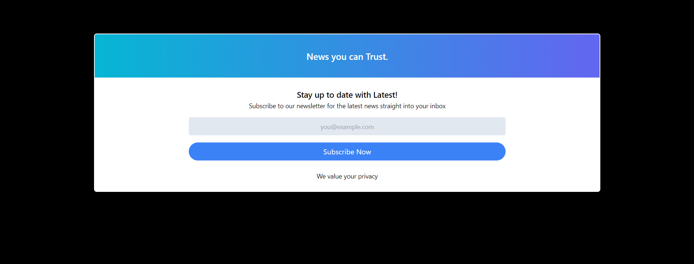

# ActivityCard Project

This project is a simple web application that showcases an activity card with a subscription form. It uses Tailwind CSS for styling and Vite for development.

## Table of Contents

- [Demo](#demo)
- [Features](#features)
- [Installation](#installation)
- [Usage](#usage)
- [Contributing](#contributing)

## Demo



## Features

- Responsive design
- Gradient background header
- Subscription form with email input and button
- Privacy notice
- Tailwind CSS for styling

## Installation

1. Clone the repository:

    ```bash
    git clone https://github.com/your-username/ActivityCard-Project.git
    ```

2. Navigate to the project directory:

    ```bash
    cd ActivityCard-Project
    ```

3. Install dependencies:

    ```bash
    npm install
    ```

4. Start the development server:

    ```bash
    npm start
    ```

## Usage

- Open your browser and navigate to `http://localhost:3000` to see the project in action.
- The subscription form is functional, but you can customize it further to integrate with your backend or email service.

## Contributing

Contributions are welcome! Please fork this repository and submit a pull request for any enhancements, bug fixes, or additional features.

1. Fork the project
2. Create your feature branch (`git checkout -b feature/AmazingFeature`)
3. Commit your changes (`git commit -m 'Add some AmazingFeature'`)
4. Push to the branch (`git push origin feature/AmazingFeature`)
5. Open a pull request
